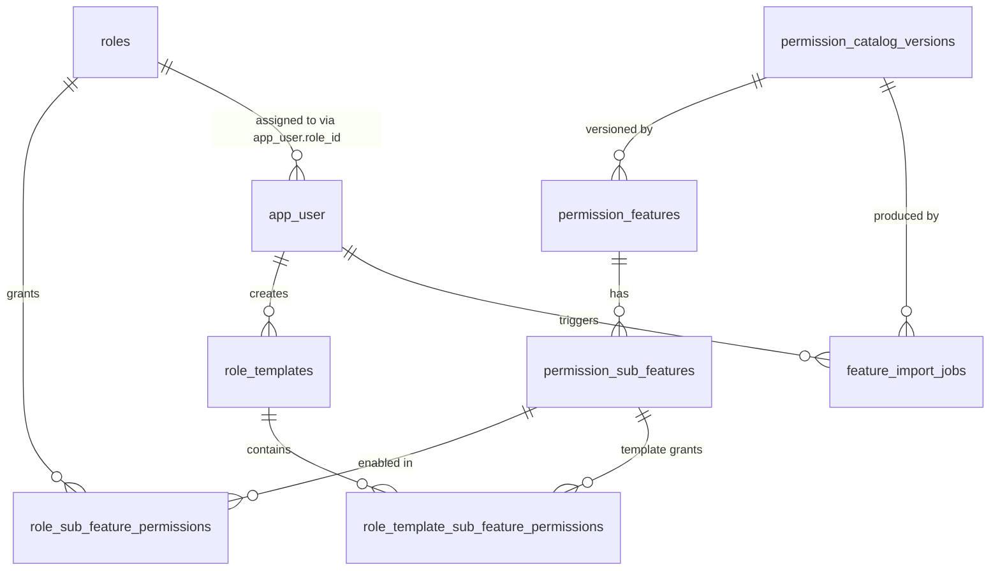

# MySQL Database Structure Documentation

## 1. Target Database

- Engine: MySQL 8+
- Charset: `utf8mb4`
- Collation: case-insensitive (default MySQL 8 `utf8mb4_0900_ai_ci`)
- Migration file: `docs/sql/001_role_management_schema.sql`

## 2. Design Goals

- Persist full role-management state currently held in frontend localStorage.
- Support dynamic feature catalog import/restore without breaking existing roles.
- Keep permission model at sub-feature granularity (source of truth).
- Derive `assignedUsersCount` from existing `app_user` role assignment.
- Preserve auditability for feature-map imports.

## 3. ER Diagram (Logical)



## 4. Tables

## 4.1 `permission_catalog_versions`

Purpose:
- Snapshot metadata for each applied catalog version.

Columns:
- `id` (PK)
- `version_code` (unique)
- `source` (`DEMO`, `IMPORT`, `MANUAL`)
- `notes`
- `payload_json` (optional full snapshot)
- `created_at`

## 4.2 `permission_features`

Purpose:
- Stores feature-level metadata (group, name, system flag, active status).

Columns:
- `id` (PK)
- `feature_key` (unique business key, example: `users-roles`)
- `feature_group`
- `feature_name`
- `feature_description`
- `is_system_feature`
- `is_active`
- `sort_order`
- `catalog_version_id` (FK -> `permission_catalog_versions.id`)
- timestamps

## 4.3 `permission_sub_features`

Purpose:
- Stores sub-feature-level metadata used by permission matrix.

Columns:
- `id` (PK)
- `feature_id` (FK -> `permission_features.id`)
- `sub_feature_key` (unique business key, example: `users-edit-role`)
- `sub_feature_name`
- `sub_feature_description`
- `is_active`
- `sort_order`
- timestamps

## 4.4 `roles`

Purpose:
- Stores role metadata.

Columns:
- `id` (PK)
- `role_uid` (external ID used in API)
- `role_name` (unique among non-deleted rows)
- `role_description`
- `role_category`
- `role_type` (`SYSTEM`, `CUSTOM`)
- `status` (`ACTIVE`, `INACTIVE`)
- `is_deleted` (soft delete)
- `deleted_at`
- timestamps

## 4.5 `app_user` (Existing Table, Reused)

Purpose:
- Existing user table used by role-management backend.

Observed key columns from your screenshot:
- `id` (PK)
- `register_user_id` (unique)
- `cognito_sub` (unique)
- `username` (unique)
- `first_name`
- `last_name`
- `email`
- `phone`
- `role_id` (nullable, references `roles.id`)
- `site_id`
- `corporation_id`
- `status`
- `created_at`
- `updated_at`

Role-management integration requirements:
- Add FK `app_user.role_id -> roles.id`.
- Ensure index on `app_user.role_id` for fast counts and assignment updates.

## 4.6 `role_sub_feature_permissions`

Purpose:
- Source-of-truth role permissions at sub-feature level.

Columns:
- `role_id` (FK -> `roles.id`)
- `sub_feature_id` (FK -> `permission_sub_features.id`)
- `is_enabled`
- timestamps

Keys:
- composite PK: (`role_id`, `sub_feature_id`)

## 4.7 `role_templates`

Purpose:
- Reusable permission templates (currently localStorage in UI).

Columns:
- `id` (PK)
- `template_uid` (external ID)
- `template_name` (unique)
- `created_by` (nullable FK -> `app_user.id`)
- `is_active`
- timestamps

## 4.8 `role_template_sub_feature_permissions`

Purpose:
- Permission rows for each template.

Columns:
- `template_id` (FK -> `role_templates.id`)
- `sub_feature_id` (FK -> `permission_sub_features.id`)
- `is_enabled`
- timestamps

Keys:
- composite PK: (`template_id`, `sub_feature_id`)

## 4.9 `feature_import_jobs`

Purpose:
- Tracks CSV/JSON validate-apply lifecycle for catalog imports.

Columns:
- `id` (PK)
- `import_uid` (external ID)
- `source_filename`
- `source_type` (`CSV`, `JSON`, `DEMO_RESTORE`)
- `status` (`VALIDATED`, `APPLIED`, `FAILED`)
- `total_rows`, `valid_rows`, `error_count`, `warning_count`
- `errors_json`, `warnings_json`
- `triggered_by` (nullable FK -> `app_user.id`)
- `catalog_version_id` (nullable FK -> `permission_catalog_versions.id`)
- `started_at`, `completed_at`

## 5. Permission Semantics

- Persist only sub-feature grants (`role_sub_feature_permissions`).
- Feature-level state in API is derived:
  - feature `enabled = true` when all its sub-features are enabled.
  - feature `indeterminate` is calculated in frontend using sub-feature counts.

## 6. Remap Rules When Catalog Changes

Inside one DB transaction:

1. Upsert features and sub-features from imported catalog.
2. Mark missing features/sub-features as `is_active = 0`.
3. Insert missing `(role, sub_feature)` permission rows with `is_enabled = 0`.
4. Force `is_enabled = 0` for inactive sub-features.
5. Store import job result and catalog version reference.

## 7. Critical Constraints

- Do not hard delete system roles.
- Do not delete role if any active `app_user` row is assigned.
- Role names must be unique case-insensitively among non-deleted roles.
- Sub-feature keys must be unique globally.

## 8. Seed Data Requirements

- Seed catalog from frontend default feature map.
- Seed 3 default system roles:
  - Administrator
  - Operator
  - Executive Viewer
- Seed role-permission rows based on seed logic.

## 9. Query Helpers

Recommended SQL view for dashboard stats:

```sql
CREATE OR REPLACE VIEW v_role_user_counts AS
SELECT
  r.id AS role_id,
  COUNT(u.id) AS assigned_users_count
FROM roles r
LEFT JOIN app_user u ON u.role_id = r.id AND u.status = 1
WHERE r.is_deleted = 0
GROUP BY r.id;
```
